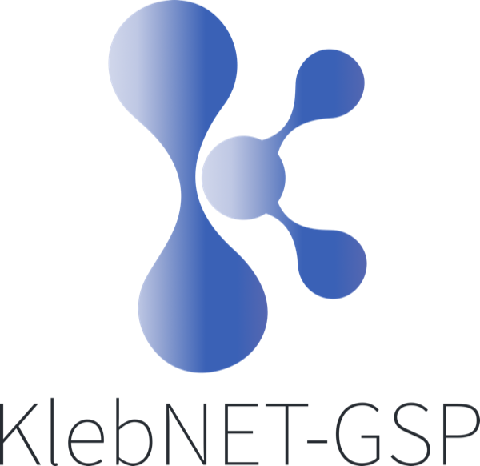

<!-- markdownlint-disable MD033 MD041 -->

<!-- markdownlint-enable MD033 MD041 -->

[](https://github.com/lshtm/klebnet)
[](https://www.gnu.org/licenses/gpl-3.0)

**KlebNET-GSP — A genomic surveillance dashboard for _Klebsiella pneumoniae_.**

KlebNET-GSP is a single-organism dashboard derived from the
[AMRnet platform](https://github.com/amrnet/amrnet). It surfaces genome-derived
antimicrobial resistance (AMR) and virulence data for _Klebsiella pneumoniae_ in
a focused, dedicated UI.

---

## Architecture

This is a fork of AMRnet (commit baseline: see `CHANGELOG.md`) reduced to a
single organism. The codebase intentionally keeps AMRnet's multi-organism
scaffolding inert (in `models/`, `client/src/util/drugs.js`, etc.) so we can
rebase against future AMRnet releases. The user-facing surface area has been
trimmed:

- `client/src/util/organismsCards.js` — only the kpneumo card is exported
- `routes/api/api.js` — only `/getDataForKpneumo`, `/getUNR`, and
  `/getCollectionCounts` are mounted

## Stack

- Backend: Node.js 22 + Express 5 + MongoDB 7
- Frontend: React 19 + Material-UI + Redux Toolkit + Recharts
- Deploy: PM2 + nginx on EC2 (mirrors AMRnet topology)

## Local development

```bash
# 1. Configure environment
cp .env.example .env
# Edit .env to point at your local mongod

# 2. Install
npm install
cd client && npm install --legacy-peer-deps && cd ..

# 3. Start
npm run start:dev   # backend on :8080, client dev server on :3000
```

The backend expects a `kpneumo` database with collection `amrnetdb_kpneumo` to
be reachable via `MONGODB_URI`.

## Database

KlebNET-GSP reads a single MongoDB database:

| Database  | Collection         | Source                         |
| --------- | ------------------ | ------------------------------ |
| `kpneumo` | `amrnetdb_kpneumo` | Extracted from AMRnet upstream |

To bootstrap data, dump just the kpneumo database from AMRnet:

```bash
mongodump --uri "$AMRNET_SOURCE_URI" --db kpneumo --out /tmp/dump
mongorestore --uri "$KLEBNET_TARGET_URI" /tmp/dump
```

## Deploy

See `deploy/setup-ec2.sh` and `deploy/deploy-production.sh` (adapted from
AMRnet, paths rebased to `/opt/klebnet`).

## TODOs after fork

A handful of cosmetic strings still reference AMRnet (deep PDF report templates
in `client/src/locales/*.json`, the user-guide / contact links in
`client/src/util/menuItems.js`). These don't break functionality — update at
leisure as the KlebNET-GSP product matures.

## License

GPL-3.0 — same as upstream AMRnet.

## Credits

Built on the [AMRnet platform](https://github.com/amrnet/amrnet) by Cerdeira LT,
Dyson ZA, Sharma V, et al. _AMRnet: a data visualization platform to
interactively explore pathogen variants and antimicrobial resistance._ Nucleic
Acids Res (2025),
[doi:10.1093/nar/gkaf1101](https://doi.org/10.1093/nar/gkaf1101).
